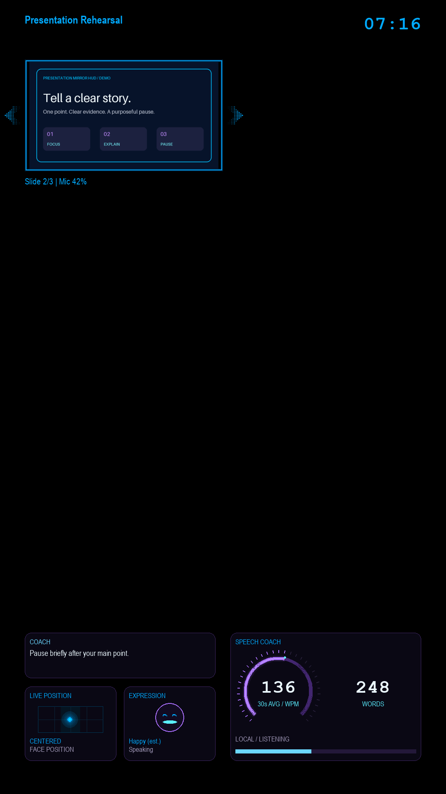

# Presentation Mirror HUD

An **offline-first Raspberry Pi presentation coach** with a neon portrait
display and a **phone/PC browser companion**. Designed for a DIY two-way mirror
over an HDMI monitor, or an ordinary monitor while developing.

**All visuals use generated demonstration content and simulated measurements.**
They are not recordings, real presentations, or evidence of recognition accuracy.

## What is included

| Component | Purpose |
| --- | --- |
| Raspberry Pi HUD | Portrait timer, readable slide preview, dotted neon navigation indicators, clear reflection area, and compact coaching cards |
| Browser companion | Start/pause/stop, image uploads, previous/next, brightness and live status from a paired phone or PC |
| Optional camera worker | Face presence, position and movement; optional seven-class facial-expression estimates |
| Optional speech worker | Local Vosk recognition, word count, rolling pace and narrow rule-based language suggestions |
| Setup and development files | Dependency manifests, generic systemd examples, tests and reproducible demo artwork |

The browser companion is served by `presenter_hud.api` and shares the Pi's local
state. It is included here, not a separate downloaded binary or cloud service.
There is no required API key or cloud account.

## Hardware checklist

| Required | Notes |
| --- | --- |
| Raspberry Pi | Pi 3 Model B or newer with a **64-bit OS and Python 3.11+**; Pi 4/5 with more RAM is recommended for additional headroom |
| microSD card and reader | A reliable 32 GB or larger card; back up existing files before imaging |
| Correct power supply | Use the supply specified for your Pi model |
| HDMI monitor and cable | A portrait-capable mount is useful; match full-size/micro-HDMI cable to your Pi |
| Keyboard and mouse | For first boot, display setup and local troubleshooting |
| USB camera | Standard UVC camera; optional for base HUD, required for camera features |
| Microphone | USB microphone or a supported webcam's microphone; required for speech features |
| DIY HUD mirror assembly | Optional two-way mirror panel in front of the monitor, with a stable frame and adequate ventilation |
| Companion device | Phone, tablet or PC with a current browser; PC recommended for straightforward SSH tunneling |

A bare monitor works: build and test the software before adding the mirror.
Use safely mounted commercial display/mirror parts; this project does not
require mains wiring modifications. Mirror tint, ambient light, and small
slide text limit readability. Brightness enhancement is software-only.

The original single-core Pi Zero/Zero W and old 32-bit installations are not
supported by this release's documented full offline stack.

## Get started

1. [Raspberry Pi setup](docs/raspberry-pi.md): OS, dependencies, portrait display,
   camera/microphone, models and optional autostart.
2. [Companion setup](companion/README.md): pairing, PC/phone access and controls.
3. [Desktop development](docs/development.md): Windows/Linux setup, tests and demo images.

**Start with the HUD and companion only.** Enable camera and speech individually
after the display works.

## Dependencies

Dependencies are not bundled in the repository:

| File | Installs |
| --- | --- |
| `requirements.txt` | Base application, using `pyproject.toml` as the source of truth |
| `requirements-build.txt` | Patched packaging tools, including replacement of older Python 3.11 bundled setuptools |
| `requirements-sensors.txt` | Optional desktop OpenCV/camera and microphone support |
| `requirements-speech.txt` | Optional offline Vosk recognition and audio support |
| `requirements-dev.txt` | Base app, tests and a dependency vulnerability scanner |
| `deploy/apt-packages.txt` | Raspberry Pi OS system libraries and distro camera/display packages |

Model installers download separately, verify checksums, and retain applicable
licenses. Normal inference runs locally after installation.

## Security and privacy

The API defaults to **loopback only**. Companion access requires a unique
locally generated bearer token, including for reading state and uploading
images. Browser pairing keeps it in memory, not in the URL or browser storage.
Use SSH tunneling for PC access; a phone/network deployment needs an encrypted,
access-restricted connection. **Do not port-forward the development server or
publish it through an anonymous tunnel.**

No credentials, tokens, device serials, account details, personal slides,
recordings, runtime state, model binaries, or historical repositories are
included. Runtime state and uploaded slides remain on the host and may contain
private information: protect the device and delete them when no longer needed.
The app does not intentionally save camera frames, raw audio, or transcripts.
It does save aggregate measurements and templated coaching/session state.

See [SECURITY.md](SECURITY.md) for the threat model and reporting guidance.
No scanner or review guarantees that software is vulnerability-free.

## Honest limits

- Facial-expression labels are **estimates**, not a person's feelings. The
  seven supported labels are angry, disgust, fearful, happy, neutral, sad and
  surprised. Laughing is not a separate class.
- Talking is shown independently from expression estimates. Noise alone does
  not count as recognized speech.
- Face position is not eye tracking, hand tracking, full-body pose or a
  psychological assessment. Expression estimates do not drive delivery advice.
- Language suggestions are a small set of deterministic, optional
  standard-English/conciseness checks, not comprehensive grammar analysis.
- Vosk may omit fillers; an unreliable filler-hit counter is deliberately not
  shown. Speech accuracy varies with microphone, background noise and accent.
- Upload PNG, JPEG or WebP images. Native presentation/PDF conversion is not
  included. Export images in your presentation software first.

## License

Original code and generated demo artwork: [MIT](LICENSE).
Dependencies and models keep their own licenses; see
[third-party notices](THIRD_PARTY_NOTICES.md).
