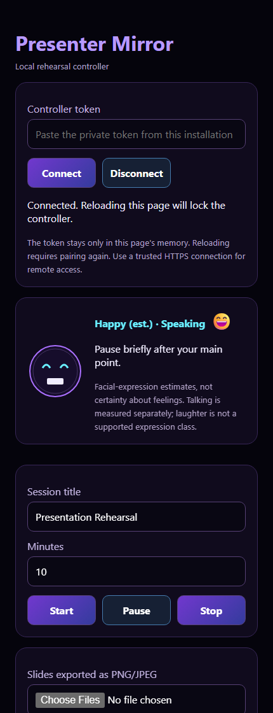

# Browser companion

The companion is the responsive web app included in
[`src/presenter_hud/api.py`](../src/presenter_hud/api.py). It runs on the Pi
alongside the HUD and opens in a phone, tablet or desktop browser. There is
**no separate app-store installation, Node build, cloud service or API key**.



## Pair locally

Start `python -m presenter_hud.api` using the project's virtual environment.
Open `http://127.0.0.1:8765` on the same computer.

First startup creates a unique private token at:

- Linux/Pi: `~/.config/presentation-mirror-hud/controller.token`
- Windows: `$HOME\.config\presentation-mirror-hud\controller.token`

Read it locally and paste its value into the pairing field. Pairing is required
even on loopback. The value stays in browser memory only; reloading the page
requires pairing again. Do not save it in URLs, screenshots, source code,
browser storage, public issues or shared terminal recordings. A custom
outside-repository path can be supplied with `--token-file`.

On shared computers, restrict access to the token file and local app data.
POSIX permissions are enforced by the application; on Windows also use your
account's NTFS permissions and keep the file outside shared/synced folders.
To revoke a token, stop the API, remove its private token file, restart and pair
again. Existing browser sessions then lose authorization.

## Connect from a PC (recommended)

Keep the Pi API bound to loopback. From the PC, forward its local port through
SSH; replace both uppercase placeholders with your own device details:

```bash
ssh -N -L 8765:127.0.0.1:8765 DEVICE_USER@DEVICE_HOST
```

Open `http://127.0.0.1:8765` on the PC and pair with the Pi's token, obtained
through a trusted local/SSH session. Verify the SSH host key and use keys or a
unique account password; the repository supplies neither.

The tunnel encrypts traffic to the Pi, and the API remains inaccessible to other
LAN devices. Close the SSH process to disconnect. If port 8765 is already used,
choose another local port and explicitly configure that loopback origin using
the API's `--allowed-origin` option.

## Connect from a phone/tablet

The secure default intentionally does not expose a raw LAN controller URL.
Use a trusted SSH-tunnel client on the phone, or an **HTTPS reverse proxy with a
valid certificate, explicit access restrictions and an exact allowed origin**.
For example, after configuring the HTTPS proxy on the Pi, the backend command
can remain loopback-only:

```bash
python -m presenter_hud.api --host 127.0.0.1 \
  --allowed-origin https://mirror.example.com
```

`mirror.example.com` is a documentation example, not a working endpoint. Set
the proxy to preserve the intended Host and Origin headers and forward only to
the local backend. Configure certificates and access rules appropriate to your
network; they are intentionally not supplied. Use a production WSGI deployment
for sustained network service, not Flask's development server.

Do not expose an HTTP bearer token on a shared Wi-Fi network. Do not port-forward
this app to the internet or use an anonymous public tunnel. LAN membership alone
does not establish trust.

## Controls

- Set the rehearsal title and duration, then start, pause or stop.
- Upload PNG/JPEG/WebP slide images and move to previous/next slides.
- Adjust software slide brightness. Text mirroring uses the HUD's `M` key.
- View live coaching, microphone level, word count and rolling pace.
- View camera position and optional expression estimates.

Uploads replace the current image set and are stored locally. Export image
slides from your presentation software first; the companion does not upload to
a conversion service. Never upload confidential material to a device you do
not control.

The display's arrows indicate available neighbors; navigate from this companion
or the Pi keyboard. Camera/speech panels need their corresponding optional
workers. Speech is not inferred merely from noise.

## API clients

Custom clients must send `Authorization: Bearer <your-local-token>` on every
`/api/*` request. JSON actions must send `Content-Type: application/json` and a
JSON object (including `{}` for actions with no fields). Image uploads use
authenticated multipart form data. The server does not enable permissive CORS.

Never hard-code a real token in scripts or tests. Load it from a protected
outside-repository file, and avoid command-line arguments or shell history that
expand the secret visibly. See the regression tests for synthetic examples.
